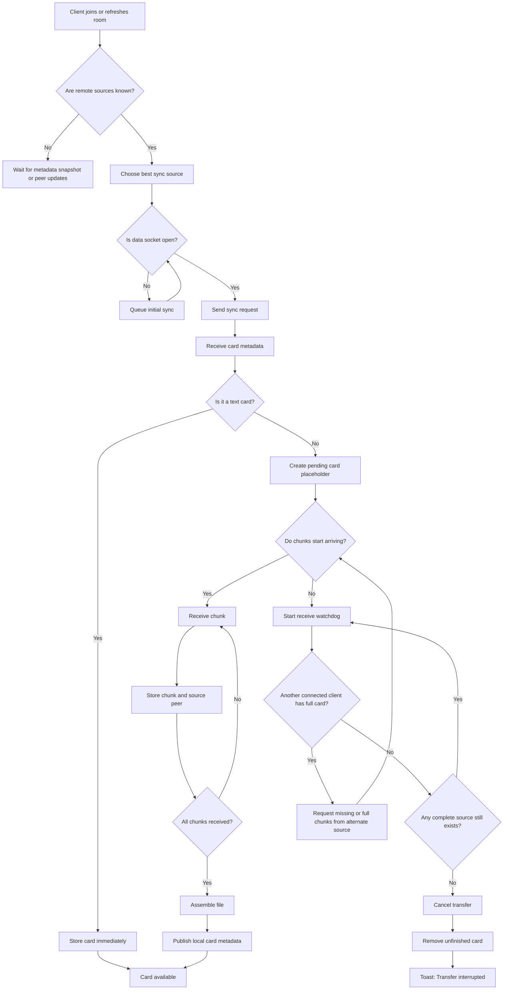
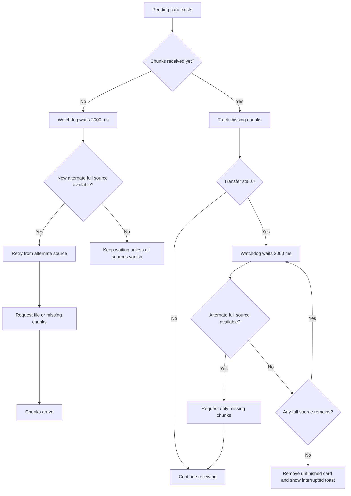

# Card Receive Flow

```mermaid
flowchart TD
  A[Client joins or refreshes room] --> B{Are remote sources known?}
  B -- No --> Z[Wait for metadata snapshot or peer updates]
  B -- Yes --> C[Choose best sync source]

  C --> D{Is data socket open?}
  D -- No --> E[Queue initial sync]
  E --> D
  D -- Yes --> F[Send sync request]

  F --> G[Receive card metadata]
  G --> H{Is it a text card?}

  H -- Yes --> I[Store card immediately]
  I --> DONE[Card available]

  H -- No --> J[Create pending card placeholder]
  J --> K{Do chunks start arriving?}

  K -- Yes --> L[Receive chunk]
  L --> M[Store chunk and source peer]
  M --> N{All chunks received?}
  N -- No --> L
  N -- Yes --> O[Assemble file]
  O --> P[Publish local card metadata]
  P --> DONE

  K -- No --> Q[Start receive watchdog]

  Q --> R{Another connected client has full card?}
  R -- No --> S{Any complete source still exists?}
  S -- Yes --> Q
  S -- No --> T[Cancel transfer]
  T --> U[Remove unfinished card]
  U --> V[Toast: Transfer interrupted]

  R -- Yes --> W[Request missing or full chunks from alternate source]
  W --> K
```

```mermaid
flowchart TD
  A[Pending card exists] --> B{Chunks received yet?}

  B -- No --> C[Watchdog waits 2000 ms]
  C --> D{New alternate full source available?}
  D -- Yes --> E[Retry from alternate source]
  E --> F[Request file or missing chunks]
  F --> G[Chunks arrive]
  D -- No --> H[Keep waiting unless all sources vanish]

  B -- Yes --> I[Track missing chunks]
  I --> J{Transfer stalls?}
  J -- No --> K[Continue receiving]
  J -- Yes --> L[Watchdog waits 2000 ms]
  L --> M{Alternate full source available?}
  M -- Yes --> N[Request only missing chunks]
  N --> K
  M -- No --> O{Any full source remains?}
  O -- Yes --> L
  O -- No --> P[Remove unfinished card and show interrupted toast]
```
