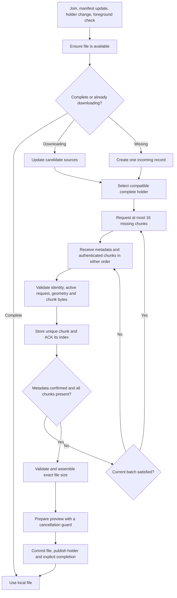
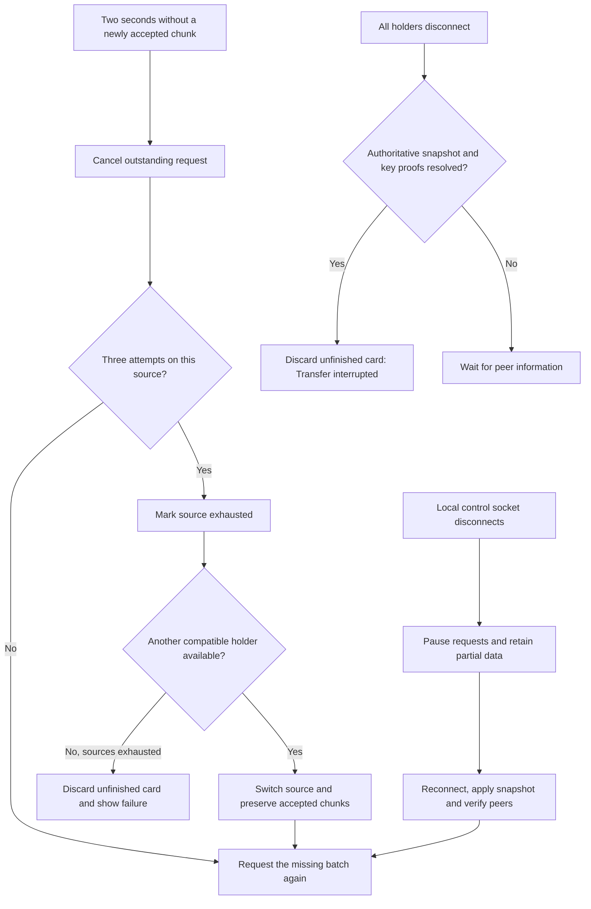

# File transfer coordination (protocol 2)

Every browser owns one `TransferCoordinator`. The manifest describes complete holders;
file contents move only in response to receiver requests. Text and chat snapshots remain
separate from file transfers. Files stay in browser memory and the maximum file size is
128 MiB. All clients must refresh when deploying protocol 2.

## Ownership and cancellation

Incoming records are keyed by file ID. Outgoing deliveries are keyed by file and
recipient, with an explicit transfer ID. Each batch has a distinct request ID.

The coordinator owns requests, recovery timers, accepted chunks and completion.
The scheduler rotates between file/recipient jobs after each chunk; blocked jobs
also yield. Transport adapters report `sent`, `blocked` or `failed`, retaining the
actual `webrtc` or `ws` transport. The server uses independent bounded binary
writers per recipient so slow recipients cannot block a sender's other deliveries.

Deletion, clearing, interruption and leaving share one disposal path. Guards check
room epoch, record identity and request identity after asynchronous work. Explicit
deletion retains a tombstone; losing the last holder only removes availability.
An existing complete holder can advertise the file again after reconnecting.
Explicit deletion tombstones remain in browser memory for the current room and
are replayed before local holder announcements on reconnect. Welcome and foreground
manifest snapshots include server tombstones, so a device removes files deleted
while it was asleep before advertising its surviving cards. Deletion takes priority
over holder revisions and device clocks; a delayed holder announcement cannot
restore a deleted card. Leaving the room clears the browser's retained tombstones.
Exhausted sources remain excluded after the failed card is removed, so repeated
discovery cannot restart the same failed download. A connection or holder
availability change allows that source to be tried again.

UI progress never determines completion: incomplete files display at most 99%.
Sender completion requires the receiver's explicit completion message. Completion
cleanup timers only remove the exact record they were created for.

## Content changes and reconnect reconciliation

`lastChangedAt` records the content change time in milliseconds since the Unix epoch.
`lastChangedBy` identifies the writer and breaks ties when two edits have the same
timestamp. Local edits advance past the item's previously observed change time, even
if the device clock moves backwards. Creation, actual text edits and deletion create
new stamps; transferring bytes, generating previews, reconnecting and announcing a
holder preserve the original stamp. Deletion replay preserves its deletion timestamp.

These fields travel in encrypted item metadata and text messages and accompany
manifest records. The manifest's `revision` and `updatedAt` track announcements and
availability separately. Higher announcement revisions cannot replace newer content
with an older copy. A newer content version initially lists only its announcing holder;
other devices advertise that version after receiving it.

On reconnect, clients compare text content versions and request a snapshot when their
copy is older. Newer local edits are announced so peers can request them. Delayed older
text snapshots and updates are ignored. Text and chat retain their separate encrypted
snapshot flow. Binary files retain immutable IDs and content versions; replacing a
file requires sharing a new card. Timestamps use device clocks and a deterministic
tie-breaker, so simultaneous unobserved edits converge without preserving both edits.

## Wire protocol

All control, data and pairing sockets include `protocolVersion=2`. Incompatible
connections receive `refresh_required` and close code 1008. Deploy server and
assets together; there is no mixed-version transfer compatibility.

File control messages use the existing encrypted relay envelope:

| Message | Fields and meaning |
| --- | --- |
| `file_request` | `itemId`, `transferId`, `requestId`, `chunkIndexes` (1–16 distinct requested indices) |
| `file_metadata` | Matching IDs and `item` metadata, including `size`, `chunkSize=65536`, `totalChunks` |
| `chunk_ack` | Matching IDs and the accepted `chunkIndex`; never implies receipt of other indices |
| `file_unavailable` | Matching IDs; try another source |
| `transfer_complete` | `itemId`, `transferId`; file was validated and committed |
| `transfer_cancel` | `itemId`, `transferId`; optional `requestId` cancels only that batch |

Binary format: `[uint32 big-endian JSON header length][UTF-8 header][12-byte IV][ciphertext and 16-byte GCM tag]`.
Header fields are `v=2`, `t=efc`, `i` (file), `x` (transfer), `q` (request),
`ci` (index), `tc` (count), `sid` (sender), `rid` (recipient), and `tid` (relay route).
The header is at most 4096 bytes; payload is at most 65536+28 bytes.

AES-GCM additional data is the UTF-8 JSON array
`[v,t,i,x,q,ci,tc,sid,rid]`. The relay removes `tid`, assigns the socket's sender
identity, and routes only to `rid`. WebRTC receivers also check the actual peer
connection identity. Only the active request may accept data; duplicates are
idempotent, stale requests are ignored, and undecryptable ciphertext is never ACKed.
Empty files use one chunk with zero plaintext bytes. Chunk count is derived from
file size and capped at 2048.

## Verification

Install Python dependencies with `python3 -m venv .venv` followed by
`.venv/bin/pip install -r requirements-dev.txt`. Install browser test dependencies
with `npm install` and `npx playwright install chromium` (or set
`CHROME_EXECUTABLE` to an existing Chrome executable).

- `npm test` — production transfer core, deterministic clocks, deferred operations and encrypted in-memory peers (Node 22 or newer).
- `.venv/bin/python -m unittest discover -s tests -v` — real connection manager, protocol endpoints, reconnect races, holder availability and slow-recipient isolation.
- `npm run test:browser` — temporary local server and isolated real browser clients; direct WebRTC, relay, fallback, reconnect, offline deletions and missed deletion snapshots, delayed metadata, thumbnail cancellation, source handoff/loss, PIN pairing, text/chat, clearing partial downloads and object URLs, refreshed retrieval and a 128 MiB byte/digest check.

The browser runner uses temporary fixtures and downloads and closes its server and
contexts afterwards. It does not connect to a deployed room. Existing diagnostics
include a coordinator snapshot with states, request IDs, attempts, sources, queues
and actual transport. Unrelated metrics publishing remains deferred.
